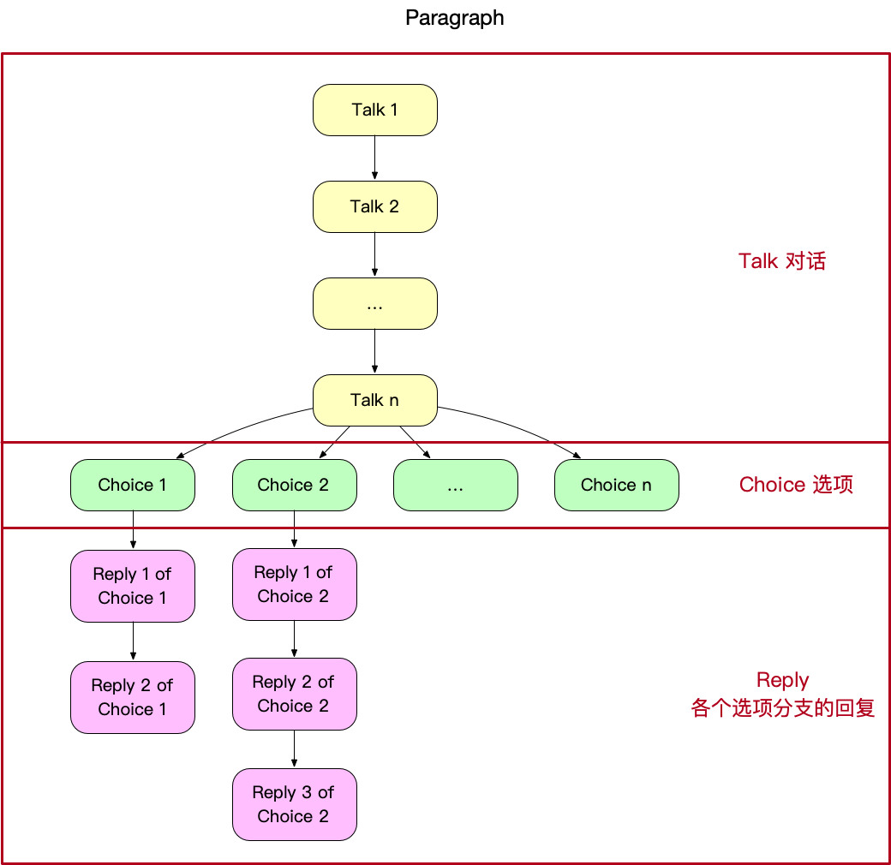
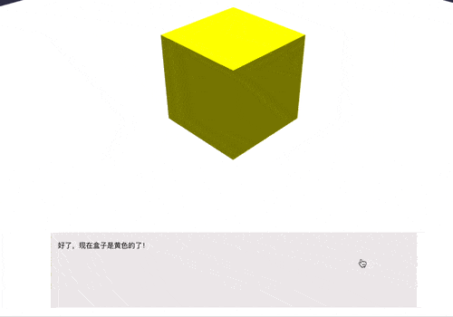

# 虚拟实验

`/src/experiments/` 目录下按文件夹存放虚拟实验。

虚拟实验的开发需遵守**约定优于配置**的原则，按照一套统一的约定进行应用开发，从而减少沟通和学习成本。

## 新建一个基本的虚拟实验

想要新建一个虚拟实验，首先在`/src/experiments/` 目录下建立新的文件夹，并在其中新建入口文件 `Entry.vue`。

```
your-awesome-experiment/
    └── Entry.vue
```

至于在 `Entry.vue` 中如何编写代码，可以参考 `/src/experiments/example-basic/` 文件夹，这是一个基础的案例，搭建了最基本的 3D 场景，配上了最简单的剧情对话。


## 基础例子与目录结构

`/src/experiments/example-basic/` 作为最基础的例子，包含了约定的虚拟实验基本目录结构，你的新实验也需要遵循该结构：

```
example-basic/
    ├── 2d
    │   ├── assets
    │   │   └── image.png               # 2D 图片文件
    │   └── script.js                   # 剧情对话的数据源
    ├── 3d
    │   └── meshes
    │       └── your-3d-model.glb       #3D 模型文件
    └── Entry.vue
```

注意：虚拟实验的根级别应只包含 3 个文件 / 文件夹，其中 `2d` 文件夹用来存放 2D 相关资源和代码，`3D` 文件夹用来存放 3D 相关资源和代码，`Entry.vue` 文件为整个实验的入口。

## 路由注册

想要将新的虚拟实验注入整个项目中，需要在路由中注册。

`/src/router/experiment.js` 文件用来注册所有实验。

::: tip
新实验想要在[网站首页](http://www.lab3d.site)的列表中出现，需要数据库中记录这个实验的信息。
:::

```js
const experimentsRoutes = [
  ...// 其他虚拟实验

  // 新注册的虚拟实验
  {
    path: '/scene/your-awesome-experiment',
    component: () => import('../experiments/your-awesome-experiment/Entry.vue')
  }
]
```

### path（必填）

- 类型：`String`
- 用法：`'/scene/' + 虚拟实验的别名`
  注意：

1. 这个别名也是你的虚拟实验文件夹的名字
2. 约定：别名需使用短横线命名法分隔单词，如 ph-scale
3. 这个别名需要和数据库中的记录字段相匹配（数据库中的记录使用驼峰命名法，如 phScale）

### component（必填）

- 类型：`Function`
- 用法：`() => import('../experiments/` + 虚拟实验的别名 + `/Entry.vue')`

## 开发环境运行虚拟实验

完成路由注册后，在浏览器的 url 栏手动输入路由以进入（需先确保项目已经[启动](../#项目启动)）。

```
以 8080 端口为例：
http://localhost:8080/scene/your-awesome-experiment
```

## 剧情对话

如[最基础的例子](./#新建一个基本的虚拟实验)中的动图所见，虚拟实验中使用 **剧情对话** 组件来和玩家对话、推进剧情、讲解知识，是虚拟实验非常重要的组成部分，剧情对话由**文案脚本**定义，写在 `/2d/script.js` 文件中，然后在 Vue 实例中调用 `this.$talker()` 来发起。

### 文案脚本

`/src/experiments/example-basic/2d/script.js` 文件定义了以下脚本文案，包含剧情对话所需的全部数据：

```js
export default {
  name: '基础实验的文案',
  paragraphs: [
    ...
  ]
}
```

该文件使用 `export default` 来导出一个对象，这个对象具有 name 和 paragraphs 两个属性，其中 name 是整个文案的标题，paragraphs 是文案具有的一系列**段落**。

### 段落 paragraph

段落是剧情对话的基本组成单位。

每个段落都必须具备唯一性，因此具有 `id` 属性。

一个段落由 **对话** `talks` 开始，对话是一个字符串数组，在全部输出完成后，弹出 **选项** `choices`，让玩家从几个选项中选择，然后根据选择进入不同的 **回复** `replies` 分支。



上方动图中的对话对应的文案脚本如下：

```js
paragraphs: [
  {
    id: '初始画面',
    talks: ['嘿~！这不是新来的程序员吗？你好呀！'],
    choices: [
      { name: '泥豪！', replies: ['很好！很有精神！'] },
      { name: '雷猴！' } // 如果选择了这个分支，将不会有回复
    ]
  }
]
```

::: tip
paragraph 在定义时，**选项**和**回复**可为空。
:::

注意 `paragraphs`、`talks`、`choices`、`replies` 属性均为数组，因此可以**连续输出多个段落**，每个段落内可以**连续输出多句话**：

```js
paragraphs: [
  {
    id: '啰嗦的段落例子',
    talks: ['我是第一句 talk', '我是第二句 talk', '我是第三句 talk'],
    choices: [
      {
        name: '我是第 1 个 choice',
        replies: [
          '我是第一个 choice 的第一个 reply',
          '我是第二个 choice 的第二个 reply',
        ]
      },
      { name: '我是第二个 choice' },
      { name: '我是第三个 choice' }
    ]
  },
  {
    id: '第二个段落',
    talks: ['第二个段落', '输出了', '不止一个的 talks']
  },
  {
    id: '第三个段落',
    talks: ['第三个段落', '同样输出了', '不止一个的 talks']
  }
]
```

<video width="100%" controls>
  <source src="../assets/example-of-paragraph.mp4" type="video/mp4">
  Your browser does not support the video tag.
</video> 

### 开始剧情对话

如果你在定义好文案脚本后，剩下的就是使用一行代码来调用了。

在 `Entry.vue` 的 `<script></script>` 标签中引入：

```js
import script from './2d/script'
```

在 `Entry.vue` 的 mounted 函数中：

```js
this.$talker({ script: script })
```

`$talker` 组件会把 `script` 中所有的 `paragraph` 都一一输出，是不是非常方便呢？

### 段落监听——choice

上文中，我们给 `this.$talker` 传入了一个包含 script 属性的对象，便将所有的段落全部都按顺序输出出来。

但是，如何实现**剧情对话和其他元素穿插进行**呢，如下图这样和 3D 动画穿插：


你可以前往 `/src/experiments/example-hooks/` 查看该虚拟实验例子

要实现这样的效果，关键是让**剧情进行到文案脚本的相应位置暂停**，然后进行其他元素操作，完成之后继续剧情对话。

```js {7-9}
paragraphs: [
  {
    id: '初始画面',
    talks: ['你想把盒子换成什么颜色？'],
    choices: [
      {
        // 监听到用户选了"黄色”选项后，需要想办法暂停剧情
        name: '黄色',
        replies: ['好了，现在盒子是黄色的了！']
      }
    ]
  }
]
```

为了实现这种效果，可以为 `this.$talker` 传入 `hooks` 数组。

`hooks` 由多个 `hook` 钩子对象组成，`hook` 钩子对象用来监听剧情进行到某个位置，然后指定你要做的其他事情。

```js {3-14}
this.$talker({
  script: script,
  hooks: [
    {
      paragraph: '初始画面', // 监听 id 为 '初始画面' 的段落
      choice: 0, // 监听用户选了 id 为 '初始画面' 的段落的第 1 个选项
      method: (tools) => {
        scene.beginAnimation(material, 0, 45, false, 1, () => {
          // 动画完成后，记得调用下面这句代码，来继续后面的剧情对话
          tools.next()
        })
      }
    }
  ]
})
```

`hook` 钩子对象中，我们给 `method` 属性赋予的值是一个[箭头函数](https://es6.ruanyifeng.com/#docs/function#箭头函数)，这是 ES6 的新语法，现在已经非常常用，如果你是第一次接触箭头函数，可能需要先学习相关语法，以及 [JavaScript 事件循环机制](http://www.ruanyifeng.com/blog/2014/10/event-loop.html)。

`method: (tools) => {...}` 指定了事件触发时，需要做的事情。上面代码中指定了当 `$talker` 监听到用户阅读到 id 为 `初始画面` 的段落，并且点击了其第一个选项（即“黄色”）时，需要更换盒子模型的材质颜色，并在完成更换颜色后，执行来自参数的 `tools` 对象的 `next()` 方法来前往接下来的剧情对话。

目前为止你只需要知道**必须在** `method` **箭头函数中的代码执行完毕后调用一次** `next()` 即可。在后文的 [tools 工具](./#tools-工具) 会详细介绍其他 `resolve` 方法。

::: tip
事实上，这里的 `next()` 用法在很多地方都会用到，如 [Vue Router 的导航守卫](https://router.vuejs.org/zh/guide/advanced/navigation-guards.html#全局前置守卫)中的 `next()`，以及 [ES6 Promise 对象](https://es6.ruanyifeng.com/#docs/promise) 的 `resolve()` 和 `reject()`。
:::

为了方便开发，除了可以给 `hook` 对象的 `choice` 属性 `number` 类型的值之外，还可以传 `'last'`，来选监听最后一个选项。

```js {3}
{
  paragraph: '初始画面',
  choice: 'last',
  method: (tools) => {
    // do something...
    tools.next()
  }
}
```

### 段落监听——talk

除了可以监听用户选了哪个选项 `choice` 之外，我们还能监听用户进行到哪个 `talk` 或 `reply`，然后在 `method` 中指定需要做的事情。

下面这个例子监听段落进行到某个 `talk` ，弹出对话框组件，让用户做一个选择题，然后继续接下来的对话。



```js
// 2d/script.js paragraphs 数组
{...},

{
  id: '让用户选择正确的选项',
  talks: [
    '现在，你来回答一下，刚刚你让盒子变成了什么颜色？',
    '好的，我注意到你已经完成了回答'
  ]
}

```

当想监听 `talk` 时，`hook` 对象中不再传 `choice` 属性， 而是 `talk` 属性。

```js {6}
// Entry.vue 的 hooks 数组
{...},

{
  paragraph: '让用户选择正确的选项',
  talk: 0,
  method: (tools) => {
    // 使用 Quasar dialog 插件来弹出对话框
    this.$q
      .dialog({
        title: '刚刚盒子变成了什么颜色',
        options: {
          type: 'radio',
          model: '',
          items: [
            { label: '红色', value: 'color1' },
            { label: '黄色', value: 'color2' },
            { label: '绿色', value: 'color3' },
          ],
        },
        persistent: true,
      })
      .onOk(() => {
        tools.next()
      })
  },
},
```

::: tip
这里使用了[Quasar 的 Dialog 插件](http://quasarchs.com/quasar-plugins/dialog)来弹出一个对话框，它提供了可以监听用户操作的钩子，因此为配合 `$talker` 的监听带来了极大便利。
:::

为了更方便地开发，`talk` 属性同样支持输入 `'last'` 来监听最后一个句 talk。

```js {3}
{
  paragraph: '让用户选择正确的选项',
  talk: 'last',
  method: (tools) => {
    // do something...
    tools.next()
  },
},

```

### 段落监听——reply

我们也可以监听玩家选择某个选项后的某个回复。和之前不同的是，监听 `reply` 需要传给钩子对象一个**对象**，指定监听选了第几个选项的第几个回复。

```js{3}
{
  paragraph: 'paragraph id',
  reply: { choice: 0, index: 0 }, // 监听第一个选项的第一句回复
  method: (tools) => {
    // do something...
    tools.next()
  },
},
```

为方便开发，`reply` 对象的 `choice` 属性支持值 `'any'`，意为监听的回复可以是任意选项的；还支持 `'last'`，意为监听的回复来自最后一个选项：

```js{3-4}
{
  paragraph: 'paragraph id',
  // 无论玩家选了这个段落的哪个选项，之后的第一句 reply 都会触发本钩子
  reply: {choice: 'any', index: 0},
  method: (tools) => {
    // do something...
    tools.next()
  },
},
```

`reply` 对象的 `index` 属性支持传入 `'last'`，来指定监听最后一句回复：

```js{3}
{
  paragraph: 'paragraph id',
  reply: {choice: 1, index: 'last'}, // 监听第二个选项后的最后一句回复
  method: (tools) => {
    // do something...
    tools.next()
  },
},
```

```js{3}
{
  paragraph: 'paragraph id',
  reply: {choice: 'any', index: 'last'}, // 监听选择了任一选项后的最后一句回复
  method: (tools) => {
    // do something...
    tools.next()
  },
},
```

:::warning
`reply` 对象必须同时具有 `choice` 属性和 `index` 属性，来完整表示想监听第几个选项的第几个回复。
:::

### tools 工具

上文中当我们使用钩子对象来监听段落时，只用了 `tools` 中的 `next()`，其实还有其他属性。

其中，`next`、`goto`和`restart` 是 `resolve` 方法，他们中的任一个都能让接下来的对话继续进行。因此，**必须确保** `resolve` **方法在任何钩子中都被严格调用一次**，否则剧情对话将会发生异常或报错。

本节的例子在 `/src/experiments/example-tools`。

#### next

next 是 `resolve` 方法，详见[上文](./#段落监听-choice)，这里不再赘述。

#### restart

restart 同样是 `resolve` 方法，作用是让对话回到当前段落的最开始。

试想我们要利用剧情对话阐述这样一个段落：

> - 对话
>   - 在刚才滴入酸溶液的时候，我们将胶头滴管伸入了**试管的内部**，这一步的实验操作其实是**不规范**的。
>   - 要注意，在滴液时如果将胶头滴管伸入试管的内部，很容易使胶头滴管**碰到试管的内壁，导致胶头滴管被污染**。
>   - 并且在下次使用被污染的胶头滴管时，还会影响到其他的药品，造成交叉污染，这样不仅会导致实验结果受到干扰，严重的还会引发化学事故哦。
> - 选项
>   - 选项一：原来是这样！
>     - 回复：看来实验师已经弄明白了刚才关于胶头滴管的说明了呀。
>   - 选项二：还..没有听明白，能重复一遍吗?
>     - 回复：当然没有问题，因为是很重要的知识，接下来我会重新再讲一遍，实验师请注意听讲哟

这个段落中，当玩家完成了选项二，应该回到这个段落的最开头。对于这个需求，可以使用 `tools.restart()` 来轻松实现。

```js{3,5}
{
  paragraph: '实验指导',
  reply: { choice: 'last', index: 'last' },
  method: (tools) => {
    tools.restart()
  },
},
```

上述代码的意思是，监听 `'实验指导'` 段落 ，当进行**最后一个选项**的**最后一句回复**时，回到段落的最开头。

#### goto

goto 同样是，而且是功能最为强大的 `resolver` 方法。

goto 可以前往任一段落的任一句 `talk` 或 `reply`。

```js{6,15,24,33-34}
// 前往 '实验指导' 段落的开头
{
  paragraph: '第二段落',
  choice: 'last',
  method: (tools) => {
    tools.goto({ paragraph: '实验指导' })
  },
},

// 前往 '实验指导' 段落的最后一句 talk
{
  paragraph: '第二段落',
  choice: 'last',
  method: (tools) => {
    tools.goto({ paragraph: '实验指导', talk: 'last' })
  },
},

// 前往 '实验指导' 段落的第一个选项的第一句 reply
{
  paragraph: '第二段落',
  choice: 'last',
  method: (tools) => {
    tools.goto({ paragraph: '实验指导', reply: {choice: 0, index: 0} })
  },
},

// 如果不指定 paragraph，则前往当前段落的某个地方
{
  paragraph: '第二段落',
  choice: 'last',
  method: (tools) => {
    // 当前段落的第一个选项的第一句回复
    tools.goto({ reply: {choice: 0, index: 0} })
  },
},
```

#### paragraph

获取当前 paragraph 对象

```js
{
  paragraph: '某个段落',
  talk: 1,
  method: (tools) => {
    const paragraph = tools.paragraph
    console.log(paragraph.name) // 输出 '某个段落'
    tools.next()
  },
},
```

#### hideChoice

作用：监听到玩家选了某个选项后，使该选项不再可选。

```js
{
  paragraph: '某个段落',
  choice: 'any',
  method: (tools) => {
    tools.hideChoice() 
    tools.restart() // 重新开始本段落后，刚刚用户选的选项不会再出现
  },
},
```

### talker API

#### script

- 类型：`object`

导入的 script 对象。

#### hooks

- 类型： `object[]`

hooks 钩子数组，钩子用来指定监听哪个段落的哪个环节并编写监听到这个环节后的代码。

#### hooks[].paragraph（必填）

- 类型：`string`

指定监听的段落。

#### hooks[].choice

- 类型：`number|string`

指定监听用户选了哪个 choice，值值从 0 开始计，可以为 'last' 来监听最后一个选项，可以为 'any' 来监听任意选项。

**注意，一个** `hooks[]` **中，**要么使用** `choice`，要么使用** `talk`，**要么使用** `reply`，**不能一个以上同时存在，也不能没有**。

#### hooks[].talk

- 类型：`number|string`

指定监听哪句 `talk`，值从 0 开始计，可以为 `'last'` 来监听最后一句 `talk`。

#### hooks[].reply

- 类型：`object`

指定监听 reply，值为对象 `{ choice: Number | String, index: Number | String }`。

#### hooks[].reply.choice （必填）

- 类型：`number|string`

指定要监听哪个选项的 `reply`，值可以为 `'any'`, 以指定监听目标属于任意选项；可以为 `'last'`，来指定监听目标属于最后一个选项。

#### hooks[].reply.index（必填）

- 类型：`number|string`

指定监听选项的第几个 `reply`，值可以为 `'last'`, 以监听最后一个 `reply`。

#### hooks[].method（必填）

- 类型：`function`

指定监听到对应事件之后要做的事，注意在完成后需要调用 `resolve` 方法来让对话继续。

## 让 Entry.vue 保持简洁

`Entry.vue` 作为虚拟实验的入口文件，需要有较高的可读性，细分功能需要提取到一个个文件模块里，每个模块各司其职，这样虚拟实验的后期可扩展性也能大大提高。

（未完）
