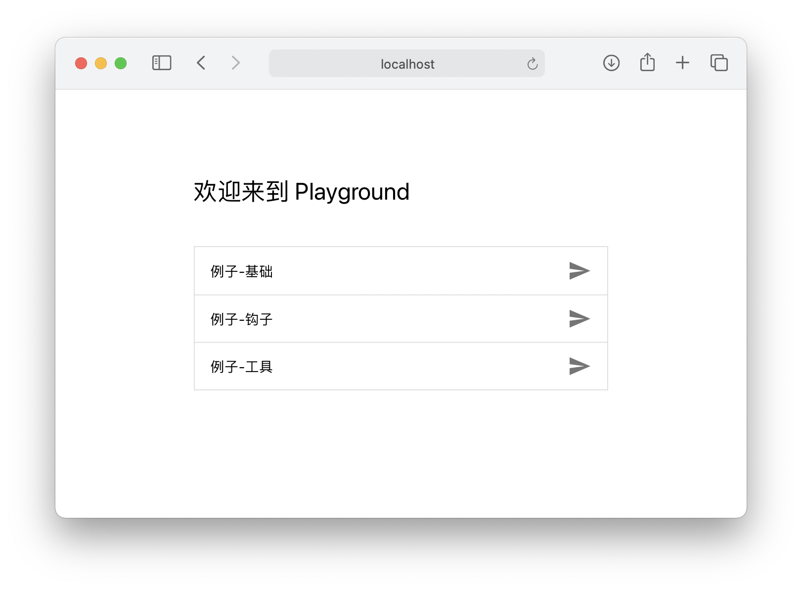

# 起步

## 安装依赖并运行

将 [Playground 项目](./introduction.md#完整项目与-playground-项目)下载到本地后解压，然后在终端打开该目录，输入以下命令安装相关依赖。

```shell
npm install
```

安装完成后，在本地启动服务器。

```shell
npm run serve
```

项目会在 [http://localhost:8080](http://localhost:8080) 启动一个热重载的开发服务器。



## 基础例子与目录结构

打开`例子-基础`，你会看到下图这样的一个例子。


这个例子的源码存放在 `/src/experiments/example-basic/` 目录下。这是一个基础的案例，搭建了最基本的 3D 场景，配上了最简单的**剧情对话**（将在后文讲解）。

作为最基础的例子，包含了约定的虚拟实验基本目录结构，你的新实验也需要遵循该结构：

```shell
example-basic/
    ├── 2d/                         # 存放所有 2D 相关文件
    │   ├── images/                     # 存放 2D 图片文件
    │   │   └── image.png
    │   ├── script.js                   # 剧情对话
    │   └── ...
    ├── 3d/                         # 存放所有 3D 相关文件
    │   ├── meshes/                     # 未来将用来存放 3D 模型文件
    │   │   └── ...
    │   └── ...
    ├── hooks/                      # 未来将用来存放钩子（Hooks）
    └── Entry.vue                   # 入口文件
```

和[基本概念](./introduction.md#基本概念)对应，一个虚拟实验文件夹下的根目录应只包含 3 个文件夹和 1 个入口文件，其中 `2d` 文件夹用来存放 2D 相关资源和代码，`3D` 文件夹用来存放 3D 相关资源和代码，`hooks` 文件夹存放钩子，`Entry.vue` 文件为整个实验的入口。

### 入口文件 Entry.vue

入口文件并不实现具体的业务逻辑，而是将实现各个业务逻辑的模块导入并整合。无论整个虚拟实验有多庞大，入口文件都要始终保持简洁，具有高可读性，这也是最初的设计意图。

从入口文件的后缀名可以看出，我们的每一个虚拟实验入口都是一个 [Vue 组件](https://cn.vuejs.org/v2/guide/components.html)。

::: tip

如果你还不熟悉 Vue ，可能对入口文件的后缀名 `.vue` 感到困扰，这其实是 Vue 的[单文件组件](https://vue-loader.vuejs.org/zh/spec.html)，他的本质是一种更优雅地编写 Vue 组件的方式，在打包阶段会被 Webpack 编译成浏览器可识别的 `.js` 文件。如果你还不熟悉 Vue 的话，可能难以理解入口文件中的代码，因此建议先[学习基础的 Vue 知识](https://www.bilibili.com/video/BV11s411A7h6)。

此外，该入口文件，以及整个虚拟实验开发过程中，都会重度使用 [ES6 语法](https://es6.ruanyifeng.com)，例如模块（module）、变量的解构赋值、Promise 对象等等，熟悉它们对理解代码非常重要。

:::

在 `template` 中，主要创建了 `id` 为 `renderCanvas` 的 canvas 元素，Babylon 引擎将会在这个 canvas 中绘制 3D 场景。

```vue
<template>
  <div id="canvasContainer">
    <canvas id="renderCanvas"></canvas>
  </div>
</template>
```

在 `script` 中，主要做了三件事：

1. 先通过 `import` 关键字引入了加载虚拟实验所需要的代码；
2. 然后声明了空值的变量 `babylonApp`，将在稍后接收 `BabylonApp` 实例；
3. 通过 `export` 关键字导出用于创建 Vue 组件的**选项 (Options)** 。

```vue
<script>
// 1. 
import BabylonApp from '../BabylonApp.js'
import script from './2d/script.js'
import initScene from './3d/initScene.js'

// 2.
let babylonApp = null

// 3.
export default {
  // 选项 ... 
}
</script>
```

在选项中，调用了 `mounted` 和 `beforeDestroy` 两个生命周期钩子：

```js
export default {
  mounted() {
    /**
     * 初始化 Babylon 的引擎，
     * 注意 babylonApp 的声明要在 `export` 语句的外面，然后在 `mounted` 里赋值
     */
    babylonApp = new BabylonApp()
    const scene = babylonApp.createScene() // 用 babylonApp 创建一个空场景

    initScene(scene).then(() => {
      // 初始场景搭建完毕后执行

      // 隐藏 babylonApp 加载界面
      babylonApp.hideLoadingUI()

      // 使用 `$talker` 组件开始剧情对话
      this.$talker({ script })
    })
  },

  beforeDestroy() {
    // Vue 实例销毁前，记得调用下面两句来确保销毁 3D 引擎
    babylonApp.destroy()
    babylonApp = null
  },
}
```

在 `mounted` 中，先利用 `BabylonApp` 来创建一个空场景。 `BabylonApp` 是公共的类，源码位于 `src/experiments/BabylonApp.js` 。你暂时不需要关心它内部做了什么，只需要知道它可以用来快速创建场景、销毁场景。

然后，在这个空场景中初始化玩家进入虚拟实验后首先见到的 3D 画面。为了保持入口文件的简洁，搭建初始场景的代码写在  `initScene()` 方法里，单独存放在 `./3d/initScene.js` 中。搭建场景靠的是 Babylon 引擎，因此在这里写的是 Babylon 相关代码。

`initScene()` 方法返回的是一个 Promise 对象，因此通过 `then()` 来确保场景全部加载完毕后再隐藏加载界面，然后开始剧情对话。关于**剧情对话 talker** 的详细介绍参见[后文](./talker.md)。

最后，在 `beforeDestroy` 中，记得调用销毁代码。

## 虚拟实验的注册

你可能已经注意到了 `/src/experiments/` 目录下有个 `list.json` 文件。该文件记录了所有在首页显示的虚拟实验，因此你若想新建一个虚拟实验，在这里注册，然后就能在项目的首页看到。`name` 是想在首页显示的名字，`alias` 是别名，虚拟实验将在位于该字段指定的路由。

```json
[
    {
        "name": "例子 1-基础",
        "alias": "example-1-basic"
    },
    {
        "name": "例子 2-钩子",
        "alias": "example-2-hooks"
    },
  	......
]
```
