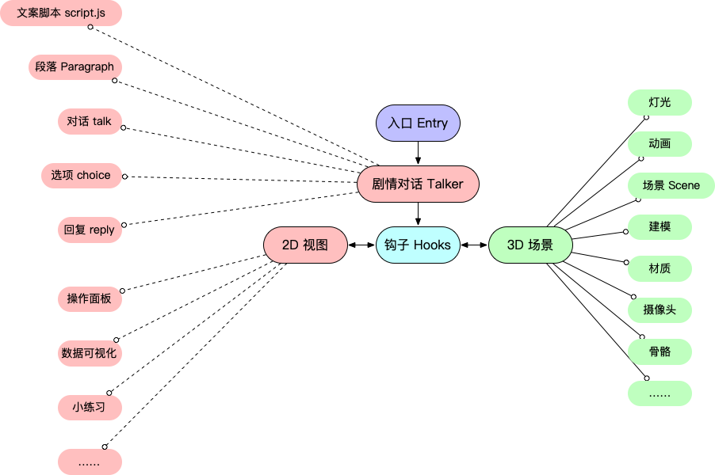

# 介绍

## 为什么有这个文档？

Lab 3D 中所有虚拟实验的开发都使用 [Babylon.js](https://babylonjs.com) 作为 3D 引擎。该 3D 引擎的确功能强大，能够满足开发虚拟实验的需求。

然而，引擎提供的只是一套在网页上显示 3D 画面的接口，至于如何优雅地组织代码，从而使代码具有较高的可读性和可扩展性，需要使用引擎的开发人员自己去费脑筋，这也是为什么在接触这个引擎的最初一段时间，缺乏经验的我们总是觉得自己写出来的 Babylon.js 代码难以阅读和维护。

不过现在，我们已经基本摸索出了在规范化的 Vue 项目内使用 Babylon.js 来开发虚拟实验的最佳实践。因此，本文旨在详细介绍我们探索出的最佳开发路径，从而使新加入的小伙伴能够快速上手，避免重复踩坑。

在这套实践中，很大程度上借鉴了**约定优于配置**的思想——大家按照一套统一的约定进行应用开发，如在某些地方必须写注释、入口文件的文件名必须叫什么名字等等，从而提高规范程度，减少沟通和学习成本。

## 基本概念

Lab 3D 平台由一个个的虚拟实验构成，每个虚拟实验又由 **2D 部分**和**3D 部分**组成，而开发过程中我们还会看到更多的概念，比如**钩子（hooks）**、**剧情对话（Talker）**。他们之间的结构大致可以用下图表示：

在接下来的文档和实际开发中会经常使用到这些概念，在遇到时如果觉得疑惑可以回过头来查看他们之间的大致关系。

## 完整项目与 Playground 项目

[完整项目](https://github.com/xuzuodong/lab-3d)包含了整个平台的所有前端代码，虚拟实验只是其中的一部分。

对于仅开发虚拟实验的同学来说，没必要拿到完整的项目代码进行开发，这样会增加不必要的心智负担。对此，我们另外创建了一个 [Playground 项目](https://github.com/xuzuodong/lab-3d-playground)，**推荐你[下载](https://github.com/xuzuodong/lab-3d-playground/archive/main.zip)它，而不是完整项目**来进行虚拟实验的学习和单个虚拟实验开发。在 Playground 项目中开发完一个虚拟实验后，再把它移植到完整项目中。

不管是 Playground 项目还是完整项目，虚拟实验都存放在`/src/experiments/` 目录下。
