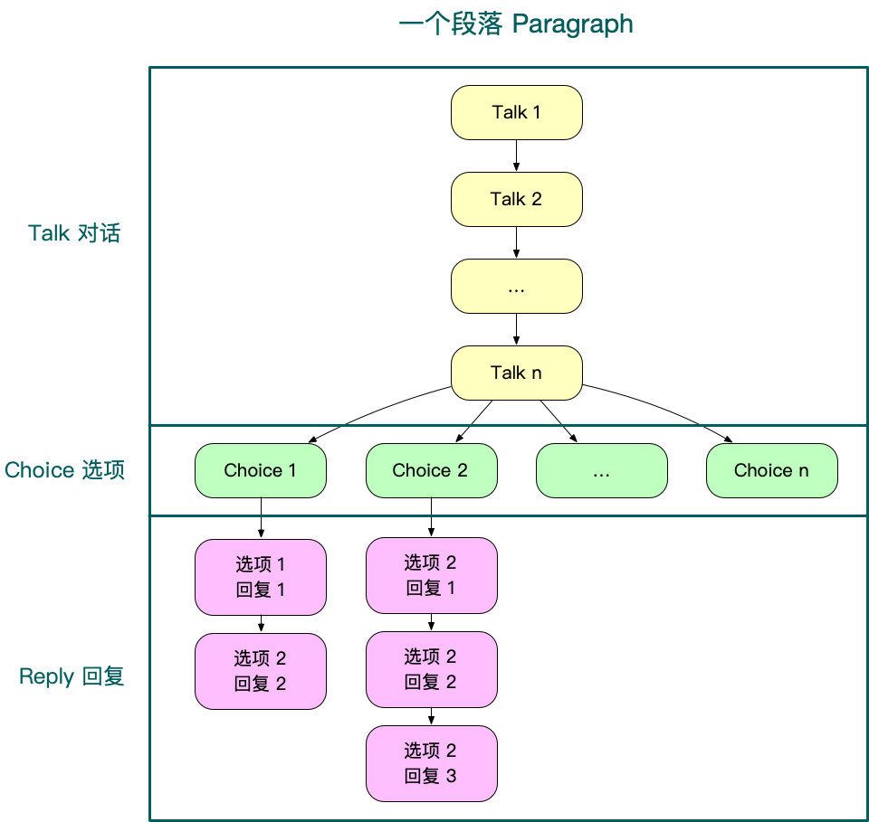
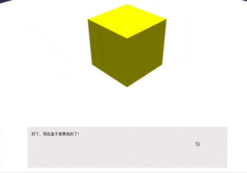

# 剧情对话

如[基础例子](./get-started.md#基础例子与目录结构)所见，虚拟实验中使用 **剧情对话** 组件 (Talker) 来和玩家对话、推进剧情、讲解知识，是虚拟实验非常重要的组成部分，剧情对话由**文案脚本**定义，写在 `/2d/script.js` 文件中，然后在 Vue 实例中调用 `this.$talker()` 来发起。

## 文案脚本

`/src/experiments/example-basic/2d/script.js` 文件定义了以下脚本文案，包含剧情对话所需的全部数据：

```js
export default {
  name: '基础实验的文案',
  paragraphs: [
    ...
  ]
}
```

该文件使用 `export default` 来导出一个对象，这个对象具有 name 和 paragraphs 两个属性，其中 name 是整个文案的标题，paragraphs 是文案具有的一系列**段落**。

## 段落 paragraph

段落是剧情对话的基本组成单位。

每个段落都必须具备唯一性，因此具有 `id` 属性。

一个段落由 **对话** `talks` 开始，对话是一个字符串数组，在全部输出完成后，弹出 **选项** `choices`，让玩家从几个选项中选择，然后根据选择进入不同的 **回复** `replies` 分支。



基础例子中的对话对应的文案脚本如下：

```js
paragraphs: [
  {
    id: '初始画面',
    talks: ['嘿~！这不是新来的程序员吗？你好呀！'],
    choices: [
      {
        name: '泥豪！',
        replies: ['很好！很有精神！']
      },
      {
        name: '雷猴！' // 如果选择了这个分支，将不会有回复
      }
    ]
  }
]
```

::: tip
paragraph 在定义时，**选项**和**回复**可为空。
:::

注意 `paragraphs`、`talks`、`choices`、`replies` 属性均为数组，因此可以**连续输出多个段落**，每个段落内可以**连续输出多句话**：

```js
paragraphs: [
  {
    id: '啰嗦的段落例子',
    talks: [
      '我是第一句 talk', 
      '我是第二句 talk', 
      '我是第三句 talk'
    ],
    choices: [
      {
        name: '我是第 1 个 choice',
        replies: [
          '我是第一个 choice 的第一个 reply', 
          '我是第二个 choice 的第二个 reply'
        ]
      },
      { name: '我是第二个 choice' },
      { name: '我是第三个 choice' }
    ]
  },
  {
    id: '第二个段落',
    talks: [
      '第二个段落', 
      '输出了', 
      '不止一个的 talks'
    ]
  },
  {
    id: '第三个段落',
    talks: [
      '第三个段落', 
      '同样输出了', 
      '不止一个的 talks'
    ]
  }
]
```

<video width="80%" controls>
  <source src="../assets/example-of-paragraph.mp4" type="video/mp4">
  Your browser does not support the video tag.
</video>

## 开始剧情对话

定义好文案脚本后，剩下的就是使用一行代码来调用了。

在 `Entry.vue` 的 `<script></script>` 标签中引入：

```js
import script from './2d/script'
```

在 `Entry.vue` 的 mounted 函数中：

```js
this.$talker({ script: script }) // 推荐简写为 this.$talker({ script })
```

`$talker` 组件会把 `script` 中所有的 `paragraph` 都一一输出，是不是非常方便呢？

## 钩子 Hooks

我们现在已经可以一次性输出整个剧情对话了，但是，如何在中途停下来，做别的事情，等完成别的事情后再继续对话呢？这就轮到钩子登场了。

### 监听 choice

我们需要给 `this.$talker` 传入钩子 `hooks` 数组，类似这样：

```js
this.$talker({ script, hooks: [...] })
```

`hooks` 由多个 `hook` 钩子对象组成，`hook` 钩子对象用来监听剧情进行到某个位置，然后指定你要做的其他事情。

为了保持入口文件简洁，我们将 `hooks` 数组写在 `hooks/index.js` 中，然后在入口文件中导入。

建议打开 **例子 2-钩子** 亲自运行下面的代码，然后查看**选择第一个选项**，以及**后两个选项**后的控制台输出情况。

```js
// hooks.js
export default [
  // 监听播放 `id` 为 `啰嗦的段落例子` 的段落时，用户选择了其第一个选项
  {
    paragraph: '啰嗦的段落例子',
    choice: 0,
    method: (tools) => {
      console.log('监听到用户选择了第一个选项')
      tools.next()
    }
  }
]
```

```js
// Entry.vue，导入 hooks 后，将其传入 $talker 中
this.$talker({ script, hooks })
```

为了前往接下来的剧情对话，我们调用了 `tools.next()`，事实上这是一个来自`talker`组件内部的 `resolve` 方法，在后文的 [钩子参数](./talker.md#钩子参数) 会详细介绍其他 `resolve` 方法。目前为止你只需要知道**必须在** `method` **箭头函数中的代码执行完毕后调用一次** `next()` 即可。

::: tip
`hook` 钩子对象中，我们给 `method` 属性赋予的值是一个[箭头函数](https://es6.ruanyifeng.com/#docs/function#箭头函数)，这是 ES6 的新语法，现在已经非常常用，如果你是第一次接触箭头函数，可能需要先学习相关语法，以及 [JavaScript 事件循环机制](http://www.ruanyifeng.com/blog/2014/10/event-loop.html)。

事实上，这里的 `next()` 用法在很多地方都会用到，如 [Vue Router 的导航守卫](https://router.vuejs.org/zh/guide/advanced/navigation-guards.html#全局前置守卫)中的 `next()`，以及 [ES6 Promise 对象](https://es6.ruanyifeng.com/#docs/promise) 的 `resolve()` 和 `reject()`。
:::

为了提高可读性，后文的示例代码的所有 `tools` 参数将使用 ES6 的解构功能，上面的代码在解构后如下：

```js {7,9}
// hooks.js
export default [
  // 监听播放 `id` 为 `啰嗦的段落例子` 的段落时，用户选择了其第一个选项
  {
    paragraph: '啰嗦的段落例子',
    choice: 0,
    method: ({ next }) => {
      console.log('监听到用户选择了第一个选项')
      next()
    }
  }
]
```

为了方便开发，除了可以给 `hook` 对象的 `choice` 属性 `number` 类型的值之外，还可以传 `'last'`，来选监听最后一个选项，或者 `'any'` 来监听用户选了该段落的任一选项。

```js {3}
{
  paragraph: '初始画面',
  choice: 'last', // 可以试试换成 'any'
  method: ({ next }) => {
    // do something...
    next()
  }
}
```

### 监听 talk

除了可以监听用户选了哪个选项 `choice` 之外，我们还能监听用户进行到哪个 `talk` 或 `reply`，然后在 `method` 中指定需要做的事情。

为了更方便地开发，`talk` 属性同样支持输入 `'last'` 来监听最后一个句 talk。

```js {3}
{
  paragraph: 'paragraph id',
  talk: 'last',
  method: ({ next }) => {
    // do something...
    next()
  },
},

```

### 监听 reply

我们也可以监听玩家选择某个选项后的某个回复。和之前不同的是，监听 `reply` 需要传给钩子对象一个**对象**，指定监听选了第几个选项的第几个回复。

```js{3}
{
  paragraph: 'paragraph id',
  reply: { choice: 0, index: 0 }, // 监听第一个选项的第一句回复
  method: ({ next }) => {
    // do something...
    next()
  },
},
```

为方便开发，`reply` 对象的 `choice` 属性支持值 `'any'`，意为监听的回复可以是任意选项的；还支持 `'last'`，意为监听的回复来自最后一个选项：

```js{3-4}
{
  paragraph: 'paragraph id',
  // 无论玩家选了这个段落的哪个选项，之后的第一句 reply 都会触发本钩子
  reply: { choice: 'any', index: 0 },
  method: ({ next }) => {
    // do something...
    next()
  },
},
```

`reply` 对象的 `index` 属性支持传入 `'last'`，来指定监听最后一句回复：

```js{3}
{
  paragraph: 'paragraph id',
  reply: { choice: 1, index: 'last' }, // 监听第二个选项后的最后一句回复
  method: ({ next }) => {
    // do something...
    next()
  },
},
```

```js{3}
{
  paragraph: 'paragraph id',
  reply: { choice: 'any', index: 'last' }, // 监听选择了任一选项后的最后一句回复
  method: ({ next }) => {
    // do something...
    next()
  },
},
```

:::warning
`reply` 对象必须同时具有 `choice` 属性和 `index` 属性，来完整表示想监听第几个选项的第几个回复。
:::

## 控制 3D 场景

上文中，我们给 `this.$talker` 传入了一个包含 script 属性的对象，便将所有的段落全部都按顺序输出出来，并且我们也可以通过**钩子**监听段落中的某一个**对话**、**选项**或**回复**。

但是，如何实现**剧情对话和其他元素穿插进行**呢，如下图这样和 3D 动画穿插：


你可以前往 `/src/experiments/example-3-3d/` 查看该虚拟实验例子。要实现这样的效果，需要进行三个关键步骤：

1. 让**剧情进行到文案脚本的相应位置暂停**。我们已经可以使用**钩子**来监听用户选择了“黄色”选项。

```js {8-10}
// 2d/script.js
paragraphs: [
  {
    id: '初始画面',
    talks: ['你想把盒子换成什么颜色？'],
    choices: [
      {
        // 剧情对话进行到这里先暂停
        name: '黄色',
        replies: ['好了，现在盒子是黄色的了！']
      }
    ]
  }
]
```

2. 然后**进行 3D 场景的操作**，让盒子从红色变成黄色。做到这一点的办法是提前编写好进行该操作的代码，然后在**钩子**中调用相应代码。

3. 盒子颜色变化完成之后**继续剧情对话**。做到这一点的办法是确保在第 2 步的操作完成后让 `$talker` 继续对话。

```js {3-14}
// hooks/index.js，导出由多个 hook 组成的数组
export default [
  // 1. 使用一个钩子来监听用户选择了“黄色”选项
  {
    paragraph: '初始画面',
    choice: 0,
    method: ({ next, scene }) => {
      // 2. 监听到后，进行 3D 场景的操作，让盒子从红色变成黄色
      scene.changeBoxColor().then(() => {
        // 3. 3D 场景的操作完成后，需要调用 `tools.next()`，来继续后面的剧情对话
        next()
      })
    }
  },

  // 其他的钩子
  {...}
]
```

注意我们是如何进行 3D 场景的操作的：我们取了钩子参数中的 `scene` 中的 `changeBoxColor ` 方法，这个方法又是哪来的呢？

### 控制 3D 场景的方法 actions

回到 `Entry.vue`，你会发现调用 `createScene()` 来创建场景时，现在传递了 actions：

```js {3,12-14}
import BabylonApp from '../BabylonApp.js'
import script from './2d/script'
import actions from './3d/actions'
import initScene from './3d/initScene'
import hooks from './hooks'

let babylonApp = null

export default {
  mounted() {
    babylonApp = new BabylonApp()
    const scene = babylonApp.createScene({
      actions,
    })

    // ...
  },

 	// ...
}
```

打开 `example-3-3d/3d/actions.js`，就能看到在钩子中调用的 `changeBoxColor()` 方法的定义：

```js
export default {
  changeBoxColor() {
    return new Promise((resolve) => {
      const box = this.getMeshByName('box')
      // 在 actions.js 文件中，`this` 指向的就是 `scene` 本身
      this.beginAnimation(box.material, 0, 45, false, 1, () => {
        resolve()
      })
    })
  }, 
  
  // ... 更多其他方法定义
}
```

**你可以在** `3d/actions.js` **中定义所有在钩子里控制 3D 界面的方法**。

有以下几点值得注意：

1. 所有控制 3D 界面的方法都需要返回一个 Promise 对象，确保方法执行完后再回到钩子中，然后在钩子中需要使用 `then()` 来前往接下来的剧情对话。

2. 在该文件中声明方法时，`this` 指向入口文件中声明的 Babylon 场景实例 `scene`，因此 `this.xxx()` 的含义为 `scene.xxx()`。你可以通过  **JSDoc 注解**来启用在该文件中编写方法时的代码提示：

   

### 3D 场景的全局状态 state

全局状态同样需要声明在 `Entry.vue` 中的 `createScene()` 里：

```js {6-8}
// Entry.vue
export default {
  mounted() {
    babylonApp = new BabylonApp()
    const scene = babylonApp.createScene({
      state: {
        abc: 'xyz'
      }
      actions,
    })

    // ...
  },

 	// ...
}
```

然后可以在钩子中取到：

``` js {6}
// hooks/index.js
{
  paragraph: 'id', 
  choice: 0, 
  method: ({ scene, next }) => {
    console.log(scene.abc) // xyz
    next()
  }
}
```

也可以在钩子中修改：

```js {6-7}
// hooks/index.js
{
  paragraph: 'id', 
  choice: 0, 
  method: ({ scene, next }) => {
    scene.mutate({ abc: 'zzz' })
    console.log(scene.abc) // zzz
    next()
  }
}
```

在 `actions.js` 中也可以进行读写：

```js {5-6}
// actions.js
export default {
  xxx() {
    return new Promise((resolve) => {
      this.mutate({ abc: 'zzz' })
      console.log(this.abc) // zzz
      resolve()
    })
  },
}
```


## 控制 2D 视图

下面这个例子监听段落进行到某个 `talk` ，弹出对话框组件，让用户做一个选择题，然后继续接下来的对话。



```js
// 2d/script.js paragraphs 数组
{...},

{
  id: '让用户选择正确的选项',
  talks: [
    '现在，你来回答一下，刚刚你让盒子变成了什么颜色？',
    '好的，我注意到你已经完成了回答'
  ]
}

```

当想监听 `talk` 时，`hook` 对象中不再传 `choice` 属性， 而是 `talk` 属性。

```js {6}
// hooks/index.js 的 hooks 数组
{...},

{
  paragraph: '让用户选择正确的选项',
  talk: 0,
  method: ({ next }) => {
    // 使用 Quasar dialog 插件来弹出对话框
    this.$q
      .dialog({
        title: '刚刚盒子变成了什么颜色',
        options: {
          type: 'radio',
          model: '',
          items: [
            { label: '红色', value: 'color1' },
            { label: '黄色', value: 'color2' },
            { label: '绿色', value: 'color3' },
          ],
        },
        persistent: true,
      })
      .onOk(() => {
        next()
      })
  },
},
```

::: tip
这里使用了[Quasar 的 Dialog 插件](http://quasarchs.com/quasar-plugins/dialog)来弹出一个对话框，它提供了可以监听用户操作的钩子，因此为配合 `$talker` 的监听带来了极大便利。
:::

## 钩子参数

上文中当我们使用钩子对象来监听段落时，只用了 `method` 提供的参数中的 `next()` 方法，其实还有其他的方法和属性可供调用。

其中，`next`、`goto`和`restart` 是 `resolve` 方法，他们中的任一个都能让接下来的对话继续进行。因此，**必须确保** `resolve` **方法在任何钩子中都被严格调用一次**，否则剧情对话将会发生异常或报错。

### next

next 是 `resolve` 方法，详见上文，这里不再赘述。

### restart

restart 同样是 `resolve` 方法，作用是让对话回到当前段落的最开始。

试想我们要利用剧情对话阐述这样一个段落：

> - 对话
>   - 在刚才滴入酸溶液的时候，我们将胶头滴管伸入了**试管的内部**，这一步的实验操作其实是**不规范**的。
>   - 要注意，在滴液时如果将胶头滴管伸入试管的内部，很容易使胶头滴管**碰到试管的内壁，导致胶头滴管被污染**。
>   - 并且在下次使用被污染的胶头滴管时，还会影响到其他的药品，造成交叉污染，这样不仅会导致实验结果受到干扰，严重的还会引发化学事故哦。
> - 选项
>   - 选项一：原来是这样！
>     - 回复：看来实验师已经弄明白了刚才关于胶头滴管的说明了呀。
>   - 选项二：还..没有听明白，能重复一遍吗?
>     - 回复：当然没有问题，因为是很重要的知识，接下来我会重新再讲一遍，实验师请注意听讲哟

这个段落中，当玩家完成了选项二，应该回到这个段落的最开头。对于这个需求，可以使用 `restart()` 来轻松实现。

```js{3,5}
{
  paragraph: '实验指导',
  reply: { choice: 'last', index: 'last' },
  method: ({ restart }) => {
    restart()
  },
},
```

上述代码的意思是，监听 `'实验指导'` 段落 ，当进行**最后一个选项**的**最后一句回复**时，回到段落的最开头。

### goto

goto 同样是，而且是功能最为强大的 `resolve` 方法。

goto 可以前往任一段落的任一句 `talk` 或 `reply`。

```js{6,15,24,33-34}
// 前往 '实验指导' 段落的开头
{
  paragraph: '第二段落',
  choice: 'last',
  method: ({ goto }) => {
    goto({ paragraph: '实验指导' })
  },
},

// 前往 '实验指导' 段落的最后一句 talk
{
  paragraph: '第二段落',
  choice: 'last',
  method: ({ goto }) => {
    goto({ paragraph: '实验指导', talk: 'last' })
  },
},

// 前往 '实验指导' 段落的第一个选项的第一句 reply
{
  paragraph: '第二段落',
  choice: 'last',
  method: ({ goto }) => {
    goto({ paragraph: '实验指导', reply: {choice: 0, index: 0} })
  },
},

// 如果不指定 paragraph，则前往当前段落的某个地方
{
  paragraph: '第二段落',
  choice: 'last',
  method: ({ goto }) => {
    // 当前段落的第一个选项的第一句回复
    goto({ reply: { choice: 0, index: 0 } })
  },
},
```

### scene

在`入口文件 Entry.vue` 中传入了的前提下，可以在钩子中获取到 3D 场景对象。

```js
// 入口文件 Entry.vue
this.$talker({ script, hooks, scene })
```

```js
// 钩子
{
  paragraph: '某个段落',
  talk: 1,
  method: ({ next, scene }) => {
    console.log(scene.meshes) // 将输出场景中的所有 mesh 对象
    next()
  },
},
```

### paragraph

获取当前 paragraph 对象

```js
{
  paragraph: '某个段落',
  talk: 1,
  method: ({ paragraph, next }) => {
    console.log(paragraph.name) // 将输出 '某个段落'
    next()
  },
},
```

### hideChoice

作用：监听到玩家选了某个选项后，使该选项不再可选。

```js
{
  paragraph: '某个段落',
  choice: 'any',
  method: ({ hideChoice, restart }) => {
    hideChoice()
    restart() // 重新开始本段落后，刚刚用户选的选项不会再出现
  },
},
```

### chosen

作用：在监听 choice 时，能够通过 `chosen` 获取用户选择了哪个选项

```js
{
  paragraph: '某个段落',
  choice: 'any',
  method: ({ chosen, next }) => {
    console.log(chosen) // 若用户选了第一个选项，则将输出 "0"
    next()
  },
},
```

### setSlot

作用：把脚本中用 ` `` ` 包裹的的反引号块中的字符替换成另一串字符。

例如有以下段落，注意 `程序员` 三个字被反引号包裹：

```js
{
  id: '初始画面',
  talks: ['嘿~！这不是新来的`程序员`吗？你好呀！'],
},
```

在输出这句话前的某个时刻，可以提前使用 `setSlot` 赋予值。

```js
{
  paragraph: '某个段落',
  choice: 0,
  method: ({ setSlot, next }) => {
    setSlot({ 程序员: '冒险家' }) // 最后输出结果将会是：嘿~！这不是新来的冒险家吗？你好呀！
    next()
  },
},
```

